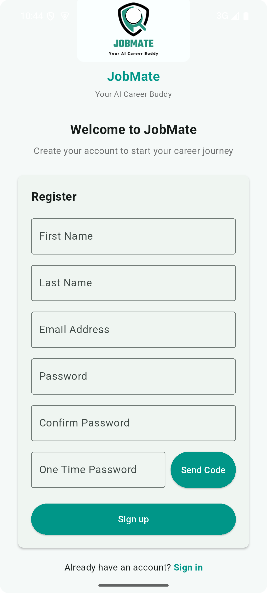
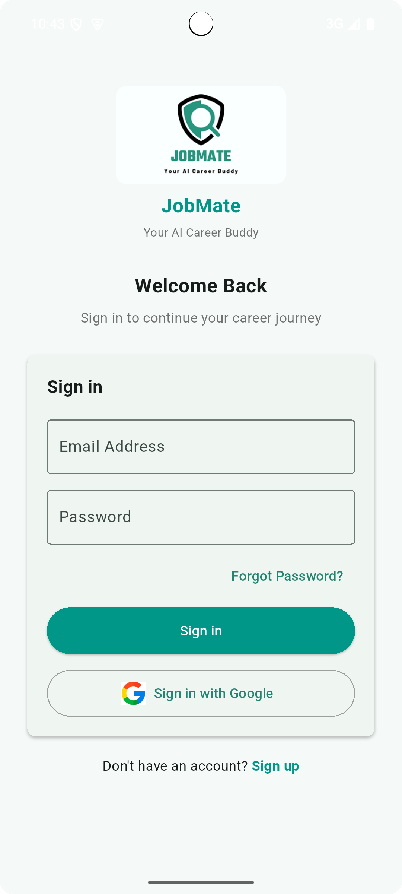
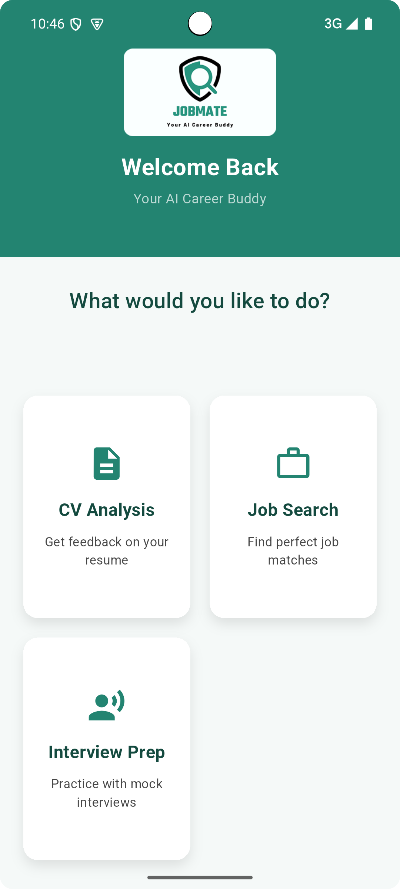
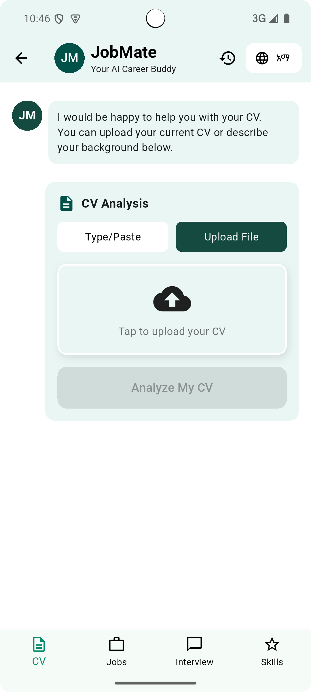
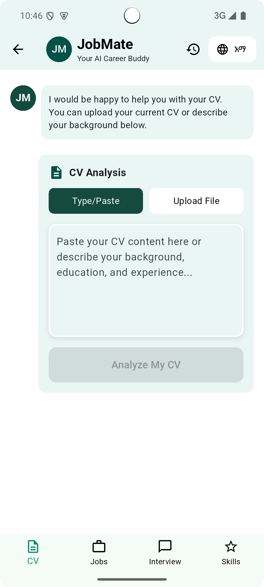
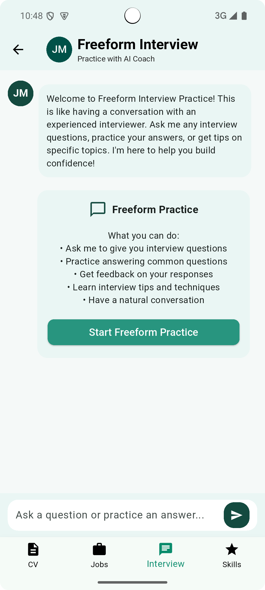
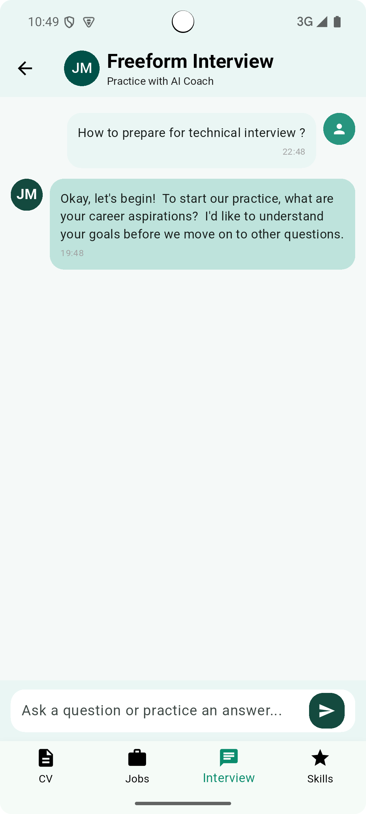
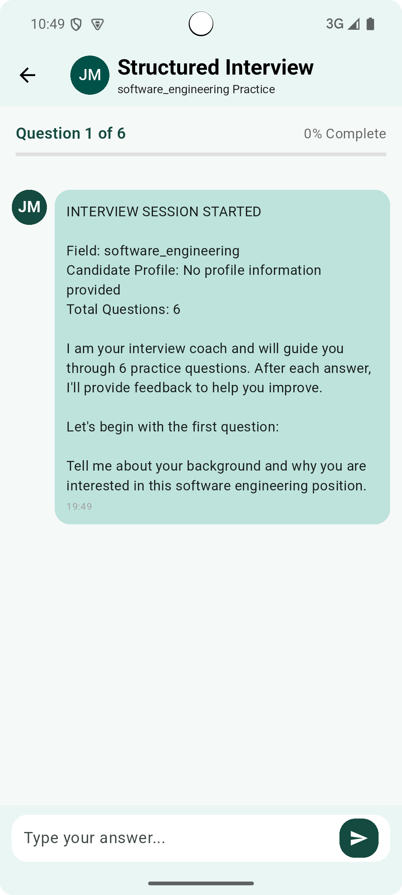
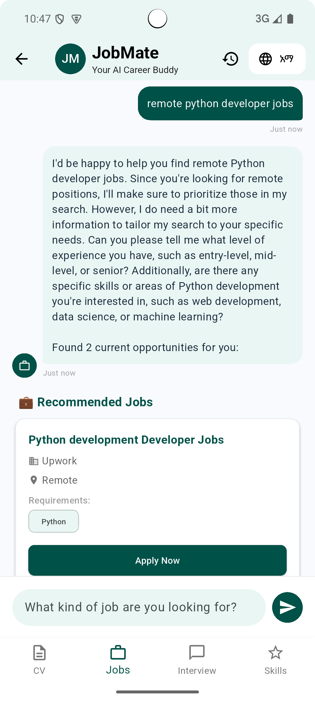

# 🚀 JobMate - AI-Powered Career Companion for Africa

[](https://flutter.dev)
[](https://nextjs.org)
[](https://golang.org)
[](https://mongodb.com)
[](https://ai.google.dev)
[](https://m3.material.io)

> **A comprehensive AI-powered career development platform specifically designed to address youth unemployment challenges in Africa. Built with cutting-edge AI technology and modern development practices.**

## 📋 **Project Overview**

JobMate is a comprehensive AI-powered career development platform designed to address youth unemployment challenges across Africa. By leveraging Google Gemini AI, the platform provides personalized career guidance, CV optimization, intelligent job matching, and interview preparation to help young Africans bridge skill gaps and connect with global opportunities.

**Key Benefits:**
- Tackles Africa's youth unemployment crisis with AI-powered solutions
- Provides personalized career guidance and skill development paths
- Offers multilingual support (English & Amharic) for accessibility
- Delivers seamless cross-platform experience (Web & Mobile)

## 📱 Application Screenshots

### 🔐 Authentication Flow (Mobile App)

| Welcome Screen | Sign Up | Login | Dashboard |
| -------------- | ------- | ----- | --------- |
|  |  |  |  |

### 📄 CV Management Features (Mobile App)

| CV Upload Interface | CV Analysis Results |
| ------------------- | ------------------- |
|  |  |

### 🎤 Interview Preparation Suite (Mobile App)

| Free-form Interview | Free-form Interview Chat | Structured Interview |
| ------------------- | -------------- | -------------------- | 
|  |  |  |

### 🔍 Job Search & AI Features (Mobile App)

| Job Search Interface |
| -------------------- |
|  |

### 🌐 Web Application
**[🚀 Try Live Demo](https://jobmate.africa)** - Full-featured web interface with responsive design

*The web application includes all mobile features plus enhanced desktop experience with advanced analytics and reporting capabilities.*

## ✨ **Key Features**

### 🤖 **AI-Powered Career Intelligence**

- **Smart CV Analysis** - Advanced AI feedback on content, structure, and ATS optimization
- **Intelligent Job Matching** - Skill-based ranking with personalized recommendations
- **Interview Coaching** - Mock sessions with real-time feedback and cultural adaptation
- **Career Path Planning** - Personalized roadmaps with skill gap analysis
- **24/7 AI Assistant** - Conversational support in English and Amharic

### 📄 **CV Management System**
- **Multi-format Upload** - Support for PDF, DOC, and image uploads
- **Real-time Analysis** - Instant feedback and improvement suggestions
- **ATS Optimization** - Resume optimization for Applicant Tracking Systems
- **Version Control** - Track CV improvements and maintain multiple versions

### 🔍 **Job Discovery & Matching**
- **Smart Search** - AI-powered job discovery with relevance scoring
- **Skill-Based Ranking** - Jobs matched to user competencies and experience
- **Application Tracking** - Monitor application status and follow-ups
- **Salary Insights** - Market data for informed career decisions
- **Remote Opportunities** - Focus on global remote work possibilities

### 🎤 **Interview Preparation Suite**
- **Free-form Interview Practice** - Open-ended AI-powered interview sessions with natural conversation
- **Structured Interview Sessions** - Guided practice with specific question formats and categories
- **Interactive Interview Chat** - Real-time AI feedback and conversation during practice sessions
- **Cultural Adaptation** - Interview tips tailored to African and international contexts
- **Performance Analytics** - Detailed feedback on responses and communication skills

### 🌐 **Multilingual & Cultural Support**
- **English & Amharic** - Native language support with seamless switching
- **Cultural Context** - Africa-focused career advice and market insights
- **Local Job Markets** - Integration with African job boards and opportunities
- **Community Features** - Connect with other job seekers and mentors

## 🏗️ Architecture

### **Frontend (Flutter & Next.js)**

```
Mobile App (Flutter)          Web App (Next.js)
├── features/                ├── app/
│   ├── auth/               │   ├── login/
│   ├── cv/                 │   ├── register/
│   ├── interview/          │   ├── dashboard/
│   └── job_search/         │   ├── cv/
├── core/                   │   ├── interview/
│   ├── network/            │   ├── chat/
│   └── presentation/       │   └── reset-password/
└── l10n/                   ├── components/
    ├── app_localizations   │   └── ui/
    └── multilingual        └── lib/
```

### **Backend (Go)**

```
backend/
├── cmd/                     # Application entry points
├── internal/
│   ├── domain/             # Business logic & entities
│   ├── handlers/           # HTTP handlers
│   ├── services/           # Business services
│   └── repository/         # Data access layer
├── pkg/                    # Shared packages
└── configs/                # Configuration files
```

## 🛠️ Technical Implementation

### **Frontend Architecture (Flutter)**

```dart
// Clean Architecture with BLoC State Management
lib/
├── core/                   # Shared utilities and constants
├── features/              # Feature-based modules
│   ├── auth/             # Authentication feature
│   ├── cv_analysis/      # CV management feature
│   ├── job_matching/     # Job discovery feature
│   └── interview/        # Interview preparation
└── shared/               # Shared widgets and services
```

**Key Technologies:**

- **Flutter 3.7+** - Cross-platform mobile framework
- **BLoC Pattern** - Predictable state management
- **Material Design 3** - Modern adaptive UI components
- **Dio** - HTTP client for API communication
- **GetIt** - Dependency injection
- **Go Router** - Declarative navigation

### **Web Architecture (Next.js)**

```typescript
// Modern React with TypeScript
src/
├── pages/                 # Next.js pages and API routes
├── components/           # Reusable UI components
├── hooks/               # Custom React hooks
├── services/            # API and business logic
├── store/               # Redux state management
└── utils/               # Utility functions
```

**Key Technologies:**

- **Next.js 15.5** - React framework with SSR/SSG
- **TypeScript** - Type-safe JavaScript
- **Redux Toolkit** - Predictable state management
- **Tailwind CSS** - Utility-first CSS framework
- **Radix UI** - Accessible component primitives

### **Backend Architecture (Go)**

```go
// Clean Architecture with Gin Framework
internal/
├── domain/              # Business entities and interfaces
├── usecase/            # Business logic implementation
├── delivery/           # HTTP handlers and middleware
└── repository/         # Data persistence layer
```

**Key Technologies:**

- **Go 1.21+** - High-performance backend language
- **Gin** - HTTP web framework
- **MongoDB** - Document-based NoSQL database
- **Google Gemini** - AI/ML integration
- **JWT** - Stateless authentication
- **Docker** - Containerization

### **Development Practices**

- **Clean Architecture** - Domain-driven design principles
- **SOLID Principles** - Maintainable and scalable code
- **Test-Driven Development** - Comprehensive testing strategy
- **CI/CD Pipeline** - Automated testing and deployment
- **Code Documentation** - Comprehensive inline documentation
- **Error Handling** - Robust exception management

## 🚀 Quick Start Guide

### 📋 Prerequisites

- **Flutter SDK** (3.7 or higher)
- **Node.js** (18 or higher)
- **Go** (1.21 or higher)
- **MongoDB** (6.0 or higher - local installation or MongoDB Atlas)
- **Google Gemini API Key** - For AI-powered features
- **Development IDE** (VS Code, Android Studio, or IntelliJ)

### ⚡ Fast Setup (5 Minutes)

#### 1. **Clone and Navigate**

```bash
git clone https://github.com/your-organization/jobmate.git
cd jobmate
```

#### 2. **Backend Configuration**

```bash
cd Backend
go mod tidy

# Create environment file
cat > .env << EOF
PORT=8080
MONGODB_URI=mongodb://localhost:27017/jobmate
GEMINI_API_KEY=your_gemini_api_key_here
JWT_SECRET=your_super_secret_jwt_key_here
GIN_MODE=release
EOF

# Start the server
go run main.go
```

#### 3. **Web Frontend Setup**

```bash
cd ../frontend
npm install

# Create environment file
cat > .env.local << EOF
NEXT_PUBLIC_API_URL=http://localhost:8080
NEXT_PUBLIC_APP_ENV=development
EOF

# Start development server
npm run dev
```

#### 4. **Mobile App Setup**

```bash
cd ../Mobile
flutter pub get

# For Android emulator
flutter run

# For iOS simulator (macOS only)
flutter run
```


## 🔐 Security Features

- **Password Hashing** with bcrypt and salt
- **JWT Token Authentication** with expiration and refresh
- **Input Validation** and sanitization across all endpoints
- **Role-Based Access Control** (RBAC) for different user types
- **Rate Limiting** to prevent API abuse
- **CORS Configuration** for secure cross-origin requests
- **Environment Variable Protection** for sensitive data
- **SQL Injection Prevention** through parameterized queries
- **XSS Protection** with content sanitization

## 📊 Key Metrics & Analytics

- **User Engagement**: CV uploads, job applications, interview sessions
- **AI Performance**: CV analysis accuracy, job match relevance scores
- **Career Outcomes**: Job placement rates, salary improvements
- **Platform Usage**: Daily/monthly active users, feature adoption
- **Geographic Distribution**: Usage across African countries
- **Language Preferences**: English vs Amharic usage patterns


## 📈 Performance Features

- **Optimized State Management** with BLoC and Redux
- **Lazy Loading** for large datasets and images
- **Caching Strategy** for API responses and static content
- **Database Indexing** for fast query performance
- **CDN Integration** for global content delivery
- **Image Optimization** with automatic compression
- **Code Splitting** for faster web app loading
- **Background Processing** for AI analysis tasks

## 🤝 Contributing

We welcome contributions from the community! Here's how you can help:

### Development Workflow

1. **Fork the repository**
   ```bash
   git clone https://github.com/your-organization/jobmate.git
   cd jobmate
   ```

2. **Create a feature branch**
   ```bash
   git checkout -b feature/amazing-feature
   ```

3. **Follow coding standards**
   - Use meaningful commit messages
   - Write tests for new features
   - Update documentation
   - Follow language-specific style guides

4. **Submit a pull request**
   ```bash
   git push origin feature/amazing-feature
   # Create PR on GitHub
   ```


## 💼 Professional Development Showcase

### **🎯 Technical Skills Demonstrated**

- **Full-Stack Development**: Complete mobile, web, and backend implementation
- **AI Integration**: Advanced AI capabilities using Google Gemini for career guidance
- **Cross-Platform Development**: Flutter mobile app and Next.js web application
- **Backend Architecture**: Go REST API with clean architecture principles
- **Database Design**: MongoDB schemas optimized for career data
- **State Management**: BLoC pattern for Flutter and Redux for web
- **Multilingual Support**: English and Amharic language implementations
- **Modern UI/UX**: Material Design 3 with responsive components

### **🏗️ Software Engineering Best Practices**

- **Clean Architecture**: Domain-driven design with clear separation of concerns
- **SOLID Principles**: Maintainable, scalable, and testable code structure
- **Comprehensive Testing**: Unit, integration, and end-to-end testing strategies
- **Error Handling**: Robust exception management with user-friendly feedback
- **Security Implementation**: JWT authentication, input validation, and data protection
- **Documentation Excellence**: Complete setup guides, API docs, and user manuals
- **Production Readiness**: Environment configuration, deployment guides, and monitoring
- **Performance Optimization**: Caching, lazy loading, and efficient state management

### **📊 Project Highlights**

- **Real-World Impact**: Addresses genuine unemployment challenges in Africa
- **AI-Powered Innovation**: Advanced CV analysis and career guidance using cutting-edge AI
- **Cultural Sensitivity**: Multilingual support and Africa-focused design
- **Scalable Architecture**: Built to handle growth and feature expansion
- **Professional Quality**: Production-ready code with comprehensive testing
- **User-Centric Design**: Intuitive interfaces designed for diverse user backgrounds

### **🎯 Key Achievements**

- ✅ **AI-Powered CV Analysis**: Advanced document processing with actionable feedback
- ✅ **Intelligent Job Matching**: Skill-based ranking with machine learning algorithms
- ✅ **Multilingual Platform**: Native English and Amharic support with cultural context
- ✅ **Cross-Platform Development**: Seamless Flutter mobile and Next.js web applications
- ✅ **Scalable Backend**: Go-based REST API with clean architecture
- ✅ **Real-World Impact**: Addresses Africa's youth unemployment crisis with innovative solutions

### **🎓 Technical Skills Demonstrated**

- **Mobile Development**: Flutter, Dart, BLoC, Material Design 3
- **Web Development**: Next.js, React, TypeScript, Redux Toolkit, Tailwind CSS
- **Backend Development**: Go, Gin, MongoDB, JWT Authentication, REST APIs
- **AI/ML Integration**: Google Gemini API, natural language processing
- **Architecture**: Clean Architecture, SOLID principles, domain-driven design
- **Security**: JWT authentication, input validation, secure data handling


---

<p align="center">
  <strong>🌍 Building a brighter future for African youth, one career at a time.</strong>
</p>

<p align="center">
  Made with ❤️ for Africa by Africans
</p>

---

**⭐ Star this repository if you find it helpful and want to support African tech innovation!**

**JobMate represents a complete AI-powered career guidance solution built with modern technologies and best practices. The platform successfully demonstrates full-stack development capabilities while providing real impact for African youth facing unemployment challenges.**
