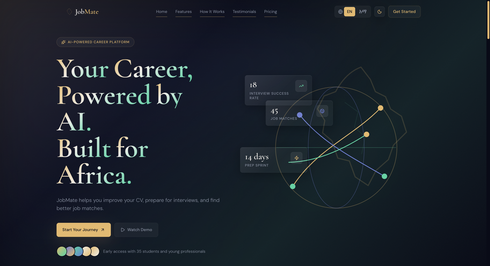
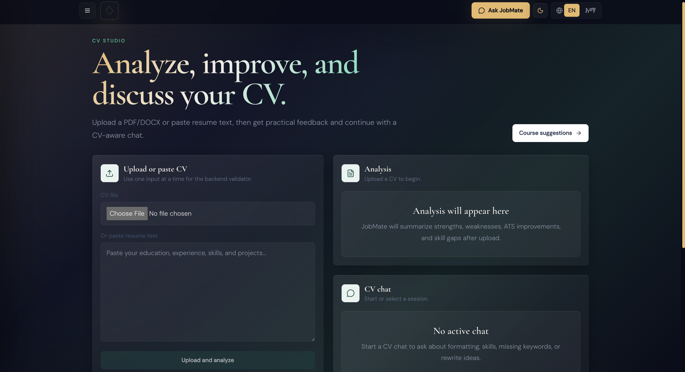
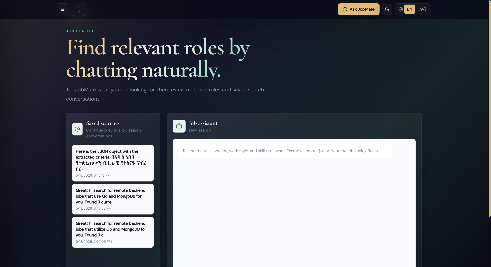
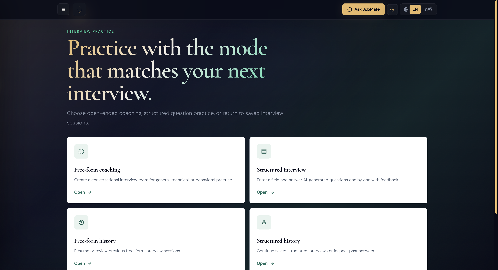
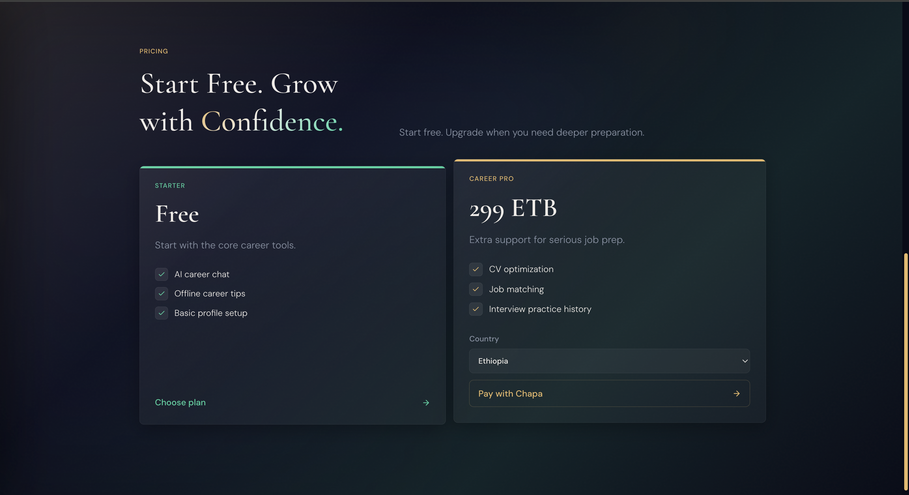

# JobMate - AI-Powered Career Companion for Africa

[](https://nextjs.org)
[](https://golang.org)
[](https://mongodb.com)
[](https://ai.google.dev)
[](https://groq.com)
[](https://chapa.co)

JobMate is an AI-powered career development platform built to support young African professionals with career guidance, CV optimization, job matching, interview preparation, course suggestions, and subscription payments.

## My Contribution

Developed RESTful APIs using Go and Gin framework for authentication, interview practice, AI-powered career features, and payment workflows while applying Clean Architecture principles to improve maintainability.

- Designed MongoDB schemas for users, OTP verification, refresh tokens, interview sessions, job chats, CV data, and payment records.
- Secured APIs by implementing JWT authentication, refresh token rotation, HTTP-only cookies, OAuth2 login, password hashing, and protected middleware.
- Built OTP-based email verification and password reset flows using secure code hashing, expiry tracking, MongoDB persistence, and Brevo transactional email delivery.
- Implemented AI-powered interview practice with freeform and structured modes, chat history, session management, and LLM-backed feedback.
- Integrated Chapa payment gateway for subscription-based payments, including payment initialization, callback handling, verification, transaction persistence, and payment status tracking.
- Added Groq as an AI fallback provider to improve reliability for CV chat, job search, and interview practice when the primary AI provider is unavailable.
- Collaborated using Git-based workflows, focused backend testing, endpoint validation, deployment debugging, and production environment configuration.

## Live Demo

[Visit JobMate](https://jobmateaicareerbuddy.vercel.app)

## Screenshots

### Welcome Page



### Dashboard


### CV Studio



### Job Search



### Interview Practice



### Pricing



## Project Overview

JobMate helps users prepare for better career opportunities through:

- Personalized AI career guidance
- CV and resume analysis
- AI-powered job search and matching
- Freeform and structured interview practice
- Course suggestions based on skill gaps
- English and Amharic language support
- Chapa-powered subscription payments for Ethiopia

## Core Features

### AI Career Support

- CV analysis and improvement suggestions
- Skill gap detection
- Course recommendations
- General career assistant chat
- English and Amharic responses

### Job Search

- AI-assisted job search conversations
- Role and skill extraction from user prompts
- Matched job cards with external links
- Saved job chat history

### Interview Practice

- Freeform interview coaching
- Structured interview sessions by field
- AI feedback on answers
- Interview history tracking

### Authentication

- User registration and login
- Email OTP verification
- Password reset with OTP
- JWT access tokens
- Refresh token cookie flow
- OAuth2 support

### Payments

- Chapa payment initialization
- Payment verification
- Callback handling
- Payment records in MongoDB
- Plan-based subscription flow

## Tech Stack

### Frontend

- Next.js App Router
- TypeScript
- Tailwind CSS
- Redux Toolkit Query
- Framer Motion
- next-themes

### Backend

- Go
- Gin
- MongoDB
- JWT authentication
- Google Gemini AI
- Groq AI fallback
- Brevo transactional email API
- Chapa payment gateway

## Project Structure

```text
JobMate
├── Backend
│   ├── delivery
│   ├── domain
│   ├── infrastructure
│   ├── repositories
│   └── usecases
├── frontend
│   ├── app
│   ├── lib
│   ├── providers
│   └── public
└── Mobile
```

## Environment Variables

### Backend

```env
APP_ENV=production
PORT=8080
BASE_URL=https://your-backend-url.onrender.com
BACKEND_URL=https://your-backend-url.onrender.com
FRONTEND_URL=https://your-frontend-url.vercel.app
ALLOWED_ORIGINS=https://your-frontend-url.vercel.app

DB_URI=mongodb+srv://...
DB_NAME=jobmate

JWT_SECRET_KEY=your_jwt_secret
JWT_EXPIRATION_MINUTES=60
JWT_ACCESS_TOKEN_EXPIRY=60
REFRESH_TOKEN_SECRET=your_refresh_secret
REFRESH_TOKEN_EXPIRATION_MINUTES=10080

BREVO_API_KEY=your_brevo_api_key
EMAIL_FROM=your_verified_sender_email
EMAIL_FROM_NAME=JobMate

GEMINI_MODEL_NAME=gemini-1.5-flash
GEMINI_API_KEY=your_gemini_key
AI_PROVIDER=groq
AI_MODEL_NAME=llama-3.1-8b-instant
AI_API_BASE_URL=https://api.groq.com/openai/v1
AI_API_KEY=your_groq_key
AI_TEMPERATURE=0.3

CHAPA_BASE_URL=https://api.chapa.co/v1
CHAPA_SECRET_KEY=your_chapa_secret_key
```

### Frontend

```env
NEXT_PUBLIC_API_URL=https://your-backend-url.onrender.com
NEXT_PUBLIC_APP_ENV=production
```

## Local Development

### Backend

```bash
cd Backend
go mod tidy
go run ./delivery
```

### Frontend

```bash
cd frontend
npm install
npm run dev
```

## Deployment

- Frontend: deployed on Vercel
- Backend: deployed on Render
- Database: MongoDB Atlas
- Email delivery: Brevo transactional email API
- Payments: Chapa

## Verification

The project has been validated through:

- Backend package tests with `go test ./...`
- Frontend linting with `npm run lint`
- Frontend production build with `npm run build`
- Manual endpoint validation for authentication, OTP, AI chat flows, job search, CV analysis, and Chapa payment flow

## Impact

JobMate is built to help young African professionals access practical career guidance, improve their CVs, prepare for interviews, discover relevant jobs, and move toward stronger local and global career opportunities.
